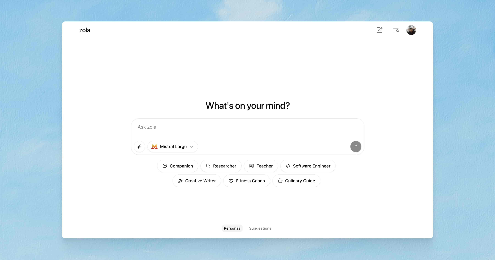

# Zola Installation Guide

Zola is a free, open-source AI chat app with multi-model support. This guide covers how to install and run Zola on different platforms, including Docker deployment options.



## Prerequisites

- Node.js 18.x or later
- npm or yarn
- Git
- Supabase account (for auth and storage)
- API keys for supported AI models (OpenAI, Mistral, etc.)

## Environment Setup

First, you'll need to set up your environment variables. Create a `.env.local` file in the root of the project with the following variables:

```bash
# Supabase
NEXT_PUBLIC_SUPABASE_URL=your_supabase_url
NEXT_PUBLIC_SUPABASE_ANON_KEY=your_supabase_anon_key
SUPABASE_SERVICE_ROLE=your_supabase_service_role_key

# OpenAI
OPENAI_API_KEY=your_openai_api_key

# Mistral
MISTRAL_API_KEY=your_mistral_api_key

# CSRF Protection
CSRF_SECRET=your_csrf_secret_key

# Optional: Set the URL for production
# NEXT_PUBLIC_VERCEL_URL=your_production_url
```

### Generating a CSRF Secret

The `CSRF_SECRET` is used to protect your application against Cross-Site Request Forgery attacks. You need to generate a secure random string for this value. Here are a few ways to generate one:

#### Using Node.js

```bash
node -e "console.log(require('crypto').randomBytes(32).toString('hex'))"
```

#### Using OpenSSL

```bash
openssl rand -hex 32
```

#### Using Python

```bash
python -c "import secrets; print(secrets.token_hex(32))"
```

Copy the generated value and add it to your `.env.local` file as the `CSRF_SECRET` value.

## Local Installation

### macOS / Linux

```bash
# Clone the repository
git clone https://github.com/ibelick/zola.git
cd zola

# Install dependencies
npm install

# Run the development server
npm run dev
```

### Windows

```bash
# Clone the repository
git clone https://github.com/ibelick/zola.git
cd zola

# Install dependencies
npm install

# Run the development server
npm run dev
```

The application will be available at [http://localhost:3000](http://localhost:3000).

## Supabase Setup

Zola requires Supabase for authentication and storage. Follow these steps to set up your Supabase project:

1. Create a new project at [Supabase](https://supabase.com)
2. Set up the database schema using the SQL script below
3. Create storage buckets for chat attachments
4. Configure authentication providers (Google OAuth)
5. Get your API keys and add them to your `.env.local` file

### Database Schema

Create the following tables in your Supabase SQL editor:

````sql
-- Users table
CREATE TABLE users (
  id UUID PRIMARY KEY REFERENCES auth.users(id) ON DELETE CASCADE,
  email TEXT NOT NULL,
  anonymous BOOLEAN DEFAULT false,
  daily_message_count INTEGER DEFAULT 0,
  daily_reset TIMESTAMPTZ,
  display_name TEXT,
  message_count INTEGER DEFAULT 0,
  preferred_model TEXT,
  premium BOOLEAN DEFAULT false,
  profile_image TEXT,
  created_at TIMESTAMPTZ DEFAULT NOW()
  last_active_at: TIMESTAMPTZ DEFAULT NOW()
);

-- Chats table
CREATE TABLE chats (
  id UUID PRIMARY KEY DEFAULT uuid_generate_v4(),
  user_id UUID REFERENCES users(id) ON DELETE CASCADE NOT NULL,
  title TEXT,
  model TEXT,
  system_prompt TEXT,
  created_at TIMESTAMPTZ DEFAULT NOW()
);

-- Messages table
CREATE TABLE messages (
  id SERIAL PRIMARY KEY,
  chat_id UUID REFERENCES chats(id) ON DELETE CASCADE NOT NULL,
  content TEXT NOT NULL,
  role TEXT NOT NULL,
  attachments JSONB,
  created_at TIMESTAMPTZ DEFAULT NOW()
);

-- Chat attachments table
CREATE TABLE chat_attachments (
  id UUID PRIMARY KEY DEFAULT uuid_generate_v4(),
  chat_id UUID REFERENCES chats(id) ON DELETE CASCADE NOT NULL,
  user_id UUID REFERENCES users(id) ON DELETE CASCADE NOT NULL,
  file_url TEXT NOT NULL,
  file_name TEXT,
  file_type TEXT,
  file_size INTEGER,
  created_at TIMESTAMPTZ DEFAULT NOW()
);

-- Feedback table
CREATE TABLE feedback (
  id UUID PRIMARY KEY DEFAULT uuid_generate_v4(),
  user_id UUID REFERENCES users(id) ON DELETE CASCADE NOT NULL,
  message TEXT NOT NULL,
  created_at TIMESTAMPTZ DEFAULT NOW()
);

-- Set up RLS policies
RLS setup and policies coming soon.
For now, make sure to enable RLS on all user-related tables:
users, chats, messages, chat_attachments, feedback

### Storage Setup

Create a bucket named `chat-attachments` with the following CORS configuration:

```json
{
  "cors": [
    {
      "origin": "*",
      "methods": ["GET", "POST", "PUT", "DELETE"],
      "headers": ["Content-Type"]
    }
  ]
}
````

## Docker Installation

### Option 1: Single Container with Docker

Create a `Dockerfile` in the root of your project if that doesnt exist:

```dockerfile
# Base Node.js image
FROM node:18-alpine AS base

# Install dependencies only when needed
FROM base AS deps
WORKDIR /app

# Copy package files
COPY package.json package-lock.json* ./

# Install dependencies with clean slate
RUN npm ci

# Rebuild the source code only when needed
FROM base AS builder
WORKDIR /app

# Copy node_modules from deps
COPY --from=deps /app/node_modules ./node_modules

# Copy all project files
COPY . .

# Set Next.js telemetry to disabled
ENV NEXT_TELEMETRY_DISABLED 1

# Build the application
RUN npm run build

# Production image, copy all the files and run next
FROM base AS runner
WORKDIR /app

# Set environment variables
ENV NODE_ENV production
ENV NEXT_TELEMETRY_DISABLED 1

# Create a non-root user
RUN addgroup --system --gid 1001 nodejs
RUN adduser --system --uid 1001 nextjs

# Set the correct permission for prerender cache
RUN mkdir -p .next/cache && chown -R nextjs:nodejs .next/cache

# Copy necessary files for production
COPY --from=builder /app/public ./public
COPY --from=builder --chown=nextjs:nodejs /app/.next/standalone ./
COPY --from=builder --chown=nextjs:nodejs /app/.next/static ./.next/static

# Switch to non-root user
USER nextjs

# Expose application port
EXPOSE 3000

# Set environment variable for port
ENV PORT 3000
ENV HOSTNAME 0.0.0.0

# Health check to verify container is running properly
HEALTHCHECK --interval=30s --timeout=5s --start-period=5s --retries=3 CMD wget --no-verbose --tries=1 --spider http://localhost:3000/ || exit 1

# Start the application
CMD ["node", "server.js"]
```

Build and run the Docker container:

```bash
# Build the Docker image
docker build -t zola .

# Run the container
docker run -p 3000:3000 \
  -e NEXT_PUBLIC_SUPABASE_URL=your_supabase_url \
  -e NEXT_PUBLIC_SUPABASE_ANON_KEY=your_supabase_anon_key \
  -e SUPABASE_SERVICE_ROLE=your_supabase_service_role_key \
  -e OPENAI_API_KEY=your_openai_api_key \
  -e MISTRAL_API_KEY=your_mistral_api_key \
  zola
```

### Option 2: Docker Compose

Create a `docker-compose.yml` file in the root of your project:

```yaml
version: "3"

services:
  zola:
    build:
      context: .
      dockerfile: Dockerfile
    ports:
      - "3000:3000"
    environment:
      - NODE_ENV=production
      - NEXT_PUBLIC_SUPABASE_URL=${NEXT_PUBLIC_SUPABASE_URL}
      - NEXT_PUBLIC_SUPABASE_ANON_KEY=${NEXT_PUBLIC_SUPABASE_ANON_KEY}
      - SUPABASE_SERVICE_ROLE=${SUPABASE_SERVICE_ROLE}
      - OPENAI_API_KEY=${OPENAI_API_KEY}
      - MISTRAL_API_KEY=${MISTRAL_API_KEY}
    restart: unless-stopped
```

Run with Docker Compose:

```bash
# Start the services
docker-compose up -d

# View logs
docker-compose logs -f

# Stop the services
docker-compose down
```

## Production Deployment

### Deploy to Vercel

The easiest way to deploy Zola is using Vercel:

1. Push your code to a Git repository (GitHub, GitLab, etc.)
2. Import the project into Vercel
3. Configure your environment variables
4. Deploy

```bash
# Install Vercel CLI
npm install -g vercel

# Deploy
vercel
```

### Self-Hosted Production

For a self-hosted production environment, you'll need to build the application and run it:

```bash
# Build the application
npm run build

# Start the production server
npm start
```

## Configuration Options

You can customize various aspects of Zola by modifying the configuration files:

- `app/lib/config.ts`: Configure AI models, daily message limits, etc.
- `.env.local`: Set environment variables and API keys

## Troubleshooting

### Common Issues

1. **Connection to Supabase fails**

   - Check your Supabase URL and API keys
   - Ensure your IP address is allowed in Supabase

2. **AI models not responding**

   - Verify your API keys for OpenAI/Mistral
   - Check that the models specified in config are available

3. **Docker container exits immediately**
   - Check logs using `docker logs <container_id>`
   - Ensure all required environment variables are set

## Community and Support

- GitHub Issues: Report bugs or request features
- GitHub Discussions: Ask questions and share ideas

## License

Apache License 2.0
