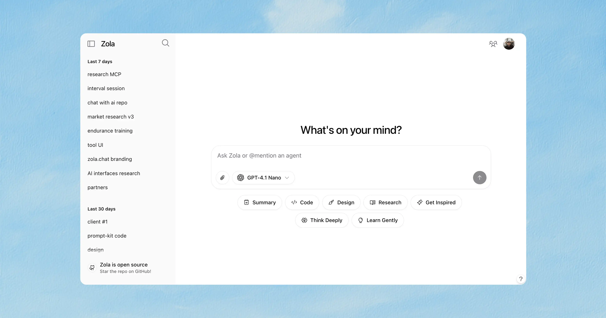

# Zola Installation Guide

Zola is a free, open-source AI chat app with multi-model support. This guide covers how to install and run Zola on different platforms, including Docker deployment options.



## Prerequisites

- Node.js 18.x or later
- npm or yarn
- Git
- Supabase account (for auth and storage)
- API keys for supported AI models (OpenAI, Mistral, etc.) OR Ollama for local models

## Environment Setup

First, you'll need to set up your environment variables. Create a `.env.local` file in the root of the project with the variables from `.env.example`

```bash
# Supabase
NEXT_PUBLIC_SUPABASE_URL=your_supabase_url
NEXT_PUBLIC_SUPABASE_ANON_KEY=your_supabase_anon_key
SUPABASE_SERVICE_ROLE=your_supabase_service_role_key

# OpenAI
OPENAI_API_KEY=your_openai_api_key

# Mistral
MISTRAL_API_KEY=your_mistral_api_key

# OpenRouter
OPENROUTER_API_KEY=your_openrouter_api_key

# CSRF Protection
CSRF_SECRET=your_csrf_secret_key

# Exa
EXA_API_KEY=your_exa_api_key

# Gemini
GOOGLE_GENERATIVE_AI_API_KEY=your_gemini_api_key

# Anthropic
ANTHROPIC_API_KEY=your_anthropic_api_key

# Xai
XAI_API_KEY=your_xai_api_key

# Ollama (for local AI models)
OLLAMA_BASE_URL=http://localhost:11434

# Optional: Set the URL for production
# NEXT_PUBLIC_VERCEL_URL=your_production_url
```

A `.env.example` file is included in the repository for reference. Copy this file to `.env.local` and update the values with your credentials.

### Generating a CSRF Secret

The `CSRF_SECRET` is used to protect your application against Cross-Site Request Forgery attacks. You need to generate a secure random string for this value. Here are a few ways to generate one:

#### Using Node.js

```bash
node -e "console.log(require('crypto').randomBytes(32).toString('hex'))"
```

#### Using OpenSSL

```bash
openssl rand -hex 32
```

#### Using Python

```bash
python -c "import secrets; print(secrets.token_hex(32))"
```

Copy the generated value and add it to your `.env.local` file as the `CSRF_SECRET` value.

### BYOK (Bring Your Own Key) Setup

Zola supports BYOK functionality, allowing users to securely store and use their own API keys for AI providers. To enable this feature, you need to configure an encryption key for secure storage of user API keys.

#### Generating an Encryption Key

The `ENCRYPTION_KEY` is used to encrypt user API keys before storing them in the database. Generate a 32-byte base64-encoded key:

```bash
# Using Node.js
node -e "console.log(require('crypto').randomBytes(32).toString('base64'))"

# Using OpenSSL
openssl rand -base64 32

# Using Python
python -c "import base64, secrets; print(base64.b64encode(secrets.token_bytes(32)).decode())"
```

Add the generated key to your `.env.local` file:

```bash
# Required for BYOK functionality
ENCRYPTION_KEY=your_generated_base64_encryption_key
```

**Important**:

- Keep this key secure and backed up - losing it will make existing user API keys unrecoverable
- Use the same key across all your deployment environments
- The key must be exactly 32 bytes when base64 decoded

With BYOK enabled, users can securely add their own API keys through the settings interface, giving them access to AI models using their personal accounts and usage limits.

#### Google OAuth Authentication

1. Go to your Supabase project dashboard
2. Navigate to Authentication > Providers
3. Find the "Google" provider
4. Enable it by toggling the switch
5. Configure the Google OAuth credentials:
   - You'll need to set up OAuth 2.0 credentials in the Google Cloud Console
   - Add your application's redirect URL: https://[YOUR_PROJECT_REF].supabase.co/auth/v1/callback
   - Get the Client ID and Client Secret from Google Cloud Console
   - Add these credentials to the Google provider settings in Supabase

Here are the detailed steps to set up Google OAuth:

1. Go to the Google Cloud Console
2. Create a new project or select an existing one
3. Enable the Google+ API
4. Go to Credentials > Create Credentials > OAuth Client ID
5. Configure the OAuth consent screen if you haven't already
6. Set the application type as "Web application"
7. Add these authorized redirect URIs:

- https://[YOUR_PROJECT_REF].supabase.co/auth/v1/callback
- http://localhost:3000/auth/callback (for local development)

8. Copy the Client ID and Client Secret
9. Go back to your Supabase dashboard
10. Paste the Client ID and Client Secret in the Google provider settings
11. Save the changes

#### Guest user setup

1. Go to your Supabase project dashboard
2. Navigate to Authentication > Providers
3. Toggle on "Allow anonymous sign-ins"

This allows users limited access to try the product before properly creating an account.

### Database Schema

Create the following tables in your Supabase SQL editor:

```sql
-- Users table
CREATE TABLE users (
  id UUID PRIMARY KEY NOT NULL, -- Assuming the PK is from auth.users, typically not nullable
  email TEXT NOT NULL,
  anonymous BOOLEAN,
  daily_message_count INTEGER,
  daily_reset TIMESTAMPTZ,
  display_name TEXT,
  favorite_models TEXT[],
  message_count INTEGER,
  premium BOOLEAN,
  profile_image TEXT,
  created_at TIMESTAMPTZ DEFAULT NOW(),
  last_active_at TIMESTAMPTZ DEFAULT NOW(),
  daily_pro_message_count INTEGER,
  daily_pro_reset TIMESTAMPTZ,
  system_prompt TEXT,
  CONSTRAINT users_id_fkey FOREIGN KEY (id) REFERENCES auth.users(id) ON DELETE CASCADE -- Explicit FK definition
);

-- Projects table
CREATE TABLE projects (
  id UUID PRIMARY KEY DEFAULT gen_random_uuid(),
  name TEXT NOT NULL,
  user_id UUID NOT NULL,
  created_at TIMESTAMPTZ DEFAULT NOW(),
  CONSTRAINT projects_user_id_fkey FOREIGN KEY (user_id) REFERENCES users(id) ON DELETE CASCADE
);

-- Chats table
CREATE TABLE chats (
  id UUID PRIMARY KEY DEFAULT uuid_generate_v4(),
  user_id UUID NOT NULL,
  project_id UUID,
  title TEXT,
  model TEXT,
  system_prompt TEXT,
  created_at TIMESTAMPTZ DEFAULT NOW(),
  updated_at TIMESTAMPTZ DEFAULT NOW(),
  public BOOLEAN DEFAULT FALSE NOT NULL,
  CONSTRAINT chats_user_id_fkey FOREIGN KEY (user_id) REFERENCES users(id) ON DELETE CASCADE,
  CONSTRAINT chats_project_id_fkey FOREIGN KEY (project_id) REFERENCES projects(id) ON DELETE CASCADE
);

-- Messages table
CREATE TABLE messages (
  id SERIAL PRIMARY KEY, -- Using SERIAL for auto-incrementing integer ID
  chat_id UUID NOT NULL,
  user_id UUID,
  content TEXT,
  role TEXT NOT NULL CHECK (role IN ('system', 'user', 'assistant', 'data')), -- Added CHECK constraint
  experimental_attachments JSONB, -- Storing Attachment[] as JSONB
  parts JSONB,
  created_at TIMESTAMPTZ DEFAULT NOW(),
  CONSTRAINT messages_chat_id_fkey FOREIGN KEY (chat_id) REFERENCES chats(id) ON DELETE CASCADE,
  CONSTRAINT messages_user_id_fkey FOREIGN KEY (user_id) REFERENCES users(id) ON DELETE CASCADE,
  message_group_id TEXT,
  model TEXT
);

-- Chat attachments table
CREATE TABLE chat_attachments (
  id UUID PRIMARY KEY DEFAULT uuid_generate_v4(),
  chat_id UUID NOT NULL,
  user_id UUID NOT NULL,
  file_url TEXT NOT NULL,
  file_name TEXT,
  file_type TEXT,
  file_size INTEGER, -- Assuming INTEGER for file size
  created_at TIMESTAMPTZ DEFAULT NOW(),
  CONSTRAINT fk_chat FOREIGN KEY (chat_id) REFERENCES chats(id) ON DELETE CASCADE,
  CONSTRAINT fk_user FOREIGN KEY (user_id) REFERENCES users(id) ON DELETE CASCADE
);

-- Feedback table
CREATE TABLE feedback (
  id UUID PRIMARY KEY DEFAULT uuid_generate_v4(),
  user_id UUID NOT NULL,
  message TEXT NOT NULL,
  created_at TIMESTAMPTZ DEFAULT NOW(),
  CONSTRAINT feedback_user_id_fkey FOREIGN KEY (user_id) REFERENCES users(id) ON DELETE CASCADE
);

-- User keys table for BYOK (Bring Your Own Key) integration
CREATE TABLE user_keys (
  user_id UUID NOT NULL REFERENCES users(id) ON DELETE CASCADE,
  provider TEXT NOT NULL,
  encrypted_key TEXT NOT NULL,
  iv TEXT NOT NULL,
  created_at TIMESTAMPTZ DEFAULT NOW(),
  updated_at TIMESTAMPTZ DEFAULT NOW(),
  PRIMARY KEY (user_id, provider)
);

-- User preferences table
CREATE TABLE user_preferences (
  user_id UUID PRIMARY KEY REFERENCES users(id) ON DELETE CASCADE,
  layout TEXT DEFAULT 'fullscreen',
  prompt_suggestions BOOLEAN DEFAULT true,
  show_tool_invocations BOOLEAN DEFAULT true,
  show_conversation_previews BOOLEAN DEFAULT true,
  multi_model_enabled BOOLEAN DEFAULT false,
  hidden_models TEXT[] DEFAULT '{}',
  created_at TIMESTAMPTZ DEFAULT NOW(),
  updated_at TIMESTAMPTZ DEFAULT NOW()
);

-- Optional: keep updated_at in sync for user_preferences
CREATE OR REPLACE FUNCTION update_user_preferences_updated_at()
RETURNS TRIGGER AS $$
BEGIN
  NEW.updated_at = NOW();
  RETURN NEW;
END;
$$ LANGUAGE plpgsql;

CREATE TRIGGER update_user_preferences_timestamp
BEFORE UPDATE ON user_preferences
FOR EACH ROW
EXECUTE PROCEDURE update_user_preferences_updated_at();

-- RLS (Row Level Security) Reminder
-- Ensure RLS is enabled on these tables in your Supabase dashboard
-- and appropriate policies are created.
-- Example policies (adapt as needed):
-- ALTER TABLE users ENABLE ROW LEVEL SECURITY;
-- CREATE POLICY "Users can view their own data." ON users FOR SELECT USING (auth.uid() = id);
-- CREATE POLICY "Users can update their own data." ON users FOR UPDATE USING (auth.uid() = id);
-- ... add policies for other tables (chats, messages, etc.) ...
```

### Storage Setup

Create the buckets `chat-attachments` and `avatars` in your Supabase dashboard:

1. Go to Storage in your Supabase dashboard
2. Click "New bucket" and create two buckets: `chat-attachments` and `avatars`
3. Configure public access permissions for both buckets

## Ollama Setup (Local AI Models)

Ollama allows you to run AI models locally on your machine. Zola has built-in support for Ollama with automatic model detection.

### Installing Ollama

#### macOS and Linux

```bash
curl -fsSL https://ollama.ai/install.sh | sh
```

#### Windows

Download and install from [ollama.ai](https://ollama.ai/download)

#### Docker

```bash
docker run -d -v ollama:/root/.ollama -p 11434:11434 --name ollama ollama/ollama
```

### Setting up Models

After installing Ollama, you can download and run models:

```bash
# Popular models to get started
ollama pull llama3.2          # Meta's Llama 3.2 (3B)
ollama pull llama3.2:1b       # Smaller, faster version
ollama pull gemma2:2b         # Google's Gemma 2 (2B)
ollama pull qwen2.5:3b        # Alibaba's Qwen 2.5 (3B)
ollama pull phi3.5:3.8b       # Microsoft's Phi 3.5 (3.8B)

# Coding-focused models
ollama pull codellama:7b      # Meta's Code Llama
ollama pull deepseek-coder:6.7b # DeepSeek Coder

# List available models
ollama list

# Start the Ollama service (if not running)
ollama serve
```

### Zola + Ollama Integration

Zola automatically detects all models available in your Ollama installation. No additional configuration is needed!

**Features:**

- **Automatic Model Detection**: Zola scans your Ollama instance and makes all models available
- **Intelligent Categorization**: Models are automatically categorized by family (Llama, Gemma, Qwen, etc.)
- **Smart Tagging**: Models get appropriate tags (local, open-source, coding, size-based)
- **No Pro Restrictions**: All Ollama models are free to use
- **Custom Endpoints**: Support for remote Ollama instances

### Configuration Options

#### Default Configuration

By default, Zola connects to Ollama at `http://localhost:11434`. This works for local installations.

#### Custom Ollama URL

To use a remote Ollama instance or custom port:

```bash
# In your .env.local file
OLLAMA_BASE_URL=http://192.168.1.100:11434
```

#### Runtime Configuration

You can also set the Ollama URL at runtime:

```bash
OLLAMA_BASE_URL=http://your-ollama-server:11434 npm run dev
```

#### Settings UI

Zola includes a settings interface where you can:

- Enable/disable Ollama integration
- Configure custom Ollama base URLs
- Add multiple Ollama instances
- Manage other AI providers

Access settings through the gear icon in the interface.

### Docker with Ollama

For a complete Docker setup with both Zola and Ollama:

```bash
# Use the provided Docker Compose file
docker-compose -f docker-compose.ollama.yml up

# Or manually with separate containers
docker run -d -v ollama:/root/.ollama -p 11434:11434 --name ollama ollama/ollama
docker run -p 3000:3000 -e OLLAMA_BASE_URL=http://ollama:11434 zola
```

The `docker-compose.ollama.yml` file includes:

- Ollama service with GPU support (if available)
- Automatic model pulling
- Health checks
- Proper networking between services

### Troubleshooting Ollama

#### Ollama not detected

1. Ensure Ollama is running: `ollama serve`
2. Check the URL: `curl http://localhost:11434/api/tags`
3. Verify firewall settings if using remote Ollama

#### Models not appearing

1. Refresh the models list in Zola settings
2. Check Ollama has models: `ollama list`
3. Restart Zola if models were added after startup

#### Performance optimization

1. Use smaller models for faster responses (1B-3B parameters)
2. Enable GPU acceleration if available
3. Adjust Ollama's `OLLAMA_NUM_PARALLEL` environment variable

## Disabling Ollama

Ollama is automatically enabled in development and disabled in production. If you want to disable it in development, you can use an environment variable:

### Environment Variable

Add this to your `.env.local` file:

```bash
# Disable Ollama in development
DISABLE_OLLAMA=true
```

### Note

- In **production**, Ollama is disabled by default to avoid connection errors
- In **development**, Ollama is enabled by default for local AI model testing
- Use `DISABLE_OLLAMA=true` to disable it in development

### Recommended Models by Use Case

#### General Chat

- `llama3.2:3b` - Good balance of quality and speed
- `gemma2:2b` - Fast and efficient
- `qwen2.5:3b` - Excellent multilingual support

#### Coding

- `codellama:7b` - Specialized for code generation
- `deepseek-coder:6.7b` - Strong coding capabilities
- `phi3.5:3.8b` - Good for code explanation

#### Creative Writing

- `llama3.2:8b` - Better for creative tasks
- `mistral:7b` - Good instruction following

#### Fast Responses

- `llama3.2:1b` - Ultra-fast, basic capabilities
- `gemma2:2b` - Quick and capable

## Local Installation

### macOS / Linux

```bash
# Clone the repository
git clone https://github.com/ibelick/zola.git
cd zola

# Install dependencies
npm install

# Run the development server
npm run dev
```

### Windows

```bash
# Clone the repository
git clone https://github.com/ibelick/zola.git
cd zola

# Install dependencies
npm install

# Run the development server
npm run dev
```

The application will be available at [http://localhost:3000](http://localhost:3000).

## Supabase Setup

Zola requires Supabase for authentication and storage. Follow these steps to set up your Supabase project:

1. Create a new project at [Supabase](https://supabase.com)
2. Set up the database schema using the SQL script below
3. Create storage buckets for chat attachments
4. Configure authentication providers (Google OAuth)
5. Get your API keys and add them to your `.env.local` file

## Docker Installation

### Option 1: Single Container with Docker

Create a `Dockerfile` in the root of your project if that doesnt exist:

```dockerfile
# Base Node.js image
FROM node:18-alpine AS base

# Install dependencies only when needed
FROM base AS deps
WORKDIR /app

# Copy package files
COPY package.json package-lock.json* ./

# Install dependencies with clean slate
RUN npm ci

# Rebuild the source code only when needed
FROM base AS builder
WORKDIR /app

# Copy node_modules from deps
COPY --from=deps /app/node_modules ./node_modules

# Copy all project files
COPY . .

# Set Next.js telemetry to disabled
ENV NEXT_TELEMETRY_DISABLED 1

# Build the application
RUN npm run build

# Production image, copy all the files and run next
FROM base AS runner
WORKDIR /app

# Set environment variables
ENV NODE_ENV production
ENV NEXT_TELEMETRY_DISABLED 1

# Create a non-root user
RUN addgroup --system --gid 1001 nodejs
RUN adduser --system --uid 1001 nextjs

# Set the correct permission for prerender cache
RUN mkdir -p .next/cache && chown -R nextjs:nodejs .next/cache

# Copy necessary files for production
COPY --from=builder /app/public ./public
COPY --from=builder --chown=nextjs:nodejs /app/.next/standalone ./
COPY --from=builder --chown=nextjs:nodejs /app/.next/static ./.next/static

# Switch to non-root user
USER nextjs

# Expose application port
EXPOSE 3000

# Set environment variable for port
ENV PORT 3000
ENV HOSTNAME 0.0.0.0

# Health check to verify container is running properly
HEALTHCHECK --interval=30s --timeout=5s --start-period=5s --retries=3 CMD wget --no-verbose --tries=1 --spider http://localhost:3000/ || exit 1

# Start the application
CMD ["node", "server.js"]
```

Build and run the Docker container:

```bash
# Build the Docker image
docker build -t zola .

# Run the container
docker run -p 3000:3000 \
  -e NEXT_PUBLIC_SUPABASE_URL=your_supabase_url \
  -e NEXT_PUBLIC_SUPABASE_ANON_KEY=your_supabase_anon_key \
  -e SUPABASE_SERVICE_ROLE=your_supabase_service_role_key \
  -e OPENAI_API_KEY=your_openai_api_key \
  -e MISTRAL_API_KEY=your_mistral_api_key \
  zola
```

### Option 2: Docker Compose

Create a `docker-compose.yml` file in the root of your project:

```yaml
version: "3"

services:
  zola:
    build:
      context: .
      dockerfile: Dockerfile
    ports:
      - "3000:3000"
    environment:
      - NODE_ENV=production
      - NEXT_PUBLIC_SUPABASE_URL=${NEXT_PUBLIC_SUPABASE_URL}
      - NEXT_PUBLIC_SUPABASE_ANON_KEY=${NEXT_PUBLIC_SUPABASE_ANON_KEY}
      - SUPABASE_SERVICE_ROLE=${SUPABASE_SERVICE_ROLE}
      - OPENAI_API_KEY=${OPENAI_API_KEY}
      - MISTRAL_API_KEY=${MISTRAL_API_KEY}
    restart: unless-stopped
```

Run with Docker Compose:

```bash
# Start the services
docker-compose up -d

# View logs
docker-compose logs -f

# Stop the services
docker-compose down
```

### Option 3: Docker Compose with Ollama (Recommended for Local AI)

For a complete setup with both Zola and Ollama running locally, use the provided `docker-compose.ollama.yml`:

```bash
# Start both Zola and Ollama services
docker-compose -f docker-compose.ollama.yml up -d

# View logs
docker-compose -f docker-compose.ollama.yml logs -f

# Stop the services
docker-compose -f docker-compose.ollama.yml down
```

This setup includes:

- **Ollama service** with GPU support (if available)
- **Automatic model pulling** (llama3.2:3b by default)
- **Health checks** for both services
- **Proper networking** between Zola and Ollama
- **Volume persistence** for Ollama models

The Ollama service will be available at `http://localhost:11434` and Zola will automatically detect all available models.

To customize which models are pulled, edit the `docker-compose.ollama.yml` file and modify the `OLLAMA_MODELS` environment variable:

```yaml
environment:
  - OLLAMA_MODELS=llama3.2:3b,gemma2:2b,qwen2.5:3b
```

## Production Deployment

### Deploy to Vercel

The easiest way to deploy Zola is using Vercel:

1. Push your code to a Git repository (GitHub, GitLab, etc.)
2. Import the project into Vercel
3. Configure your environment variables
4. Deploy

```bash
# Install Vercel CLI
npm install -g vercel

# Deploy
vercel
```

### Self-Hosted Production

For a self-hosted production environment, you'll need to build the application and run it:

```bash
# Build the application
npm run build

# Start the production server
npm start
```

## Configuration Options

You can customize various aspects of Zola by modifying the configuration files:

- `app/lib/config.ts`: Configure AI models, daily message limits, etc.
- `.env.local`: Set environment variables and API keys

## Troubleshooting

### Common Issues

1. **Connection to Supabase fails**

   - Check your Supabase URL and API keys
   - Ensure your IP address is allowed in Supabase

2. **AI models not responding**

   - Verify your API keys for OpenAI/Mistral
   - Check that the models specified in config are available

3. **Docker container exits immediately**
   - Check logs using `docker logs <container_id>`
   - Ensure all required environment variables are set

## Community and Support

- GitHub Issues: Report bugs or request features
- GitHub Discussions: Ask questions and share ideas

## License

Apache License 2.0
