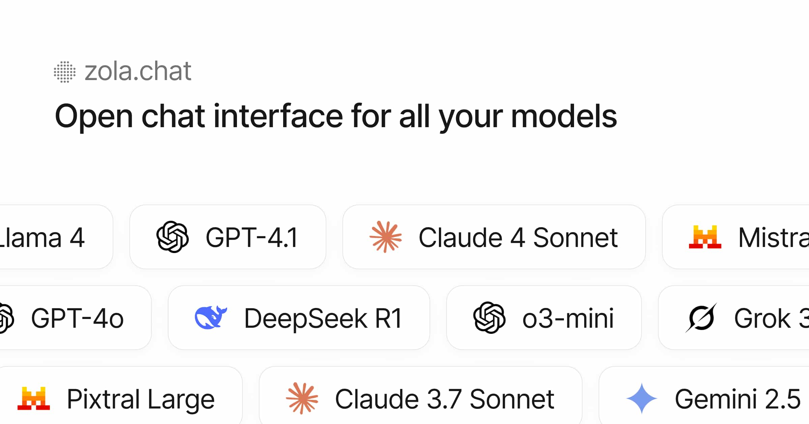

# Okie

[okie.one](https://okie.one)

**Okie** is the open-source chat interface for all your models.



## Features

- Multi-model support: OpenAI, Mistral, Claude, Gemini, Ollama (local models)
- Bring your own API key (BYOK) support via OpenRouter
- File uploads
- Clean, responsive UI with light/dark themes
- Built with Tailwind CSS, shadcn/ui, and prompt-kit
- Open-source and self-hostable
- Customizable: user system prompt, multiple layout options
- Local AI with Ollama: Run models locally with automatic model detection
- Full MCP support (wip)

## Quick Start

Example with OpenAI

```bash
git clone https://github.com/your-username/okie.git
cd okie
pnpm install
echo "OPENAI_API_KEY=your-key" > .env.local
pnpm run dev
```

Example with Ollama

```bash
git clone https://github.com/your-username/okie.git
cd okie
docker-compose -f docker-compose.ollama.yml up
```

To unlock features like auth, file uploads, see [INSTALL.md](./INSTALL.md).

## Built with

This project is forked from [Zola](https://github.com/ibelick/zola) by [@ibelick](https://github.com/ibelick).

- [prompt-kit](https://prompt-kit.com/) — AI components
- [shadcn/ui](https://ui.shadcn.com) — core components
- [motion-primitives](https://motion-primitives.com) — animated components
- [vercel ai sdk](https://vercel.com/blog/introducing-the-vercel-ai-sdk) — model integration, AI features
- [supabase](https://supabase.com) — auth and storage

## License

Apache License 2.0