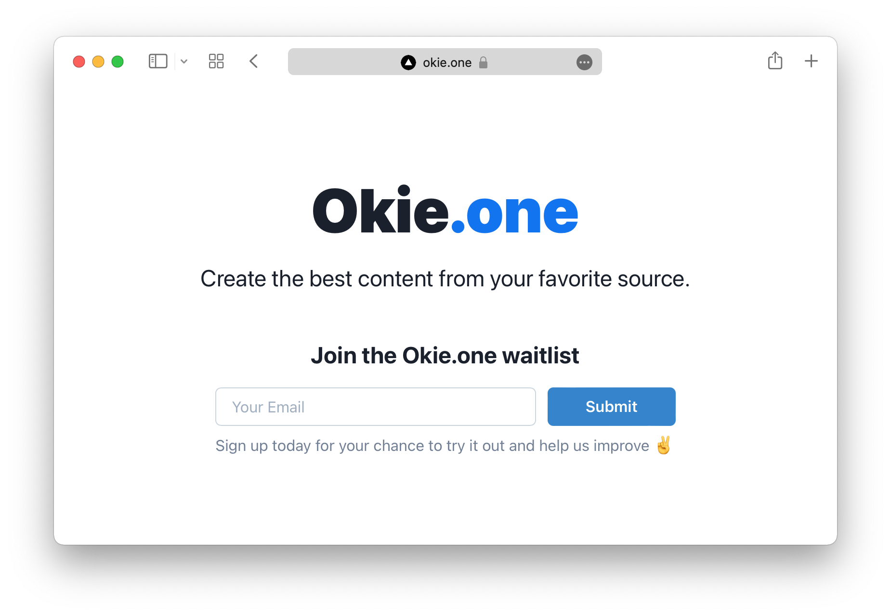

## Getting Started

First, create the `.env.local`:

```
NEXT_PUBLIC_GOOGLE_ANALYTICS=G-xxxxxxx
NOTION_API_KEY=secret_**************
NOTION_DATABASE_ID=************
```

Run the development server:

```bash
yarn dev
```

Open [http://localhost:3000](http://localhost:3000) with your browser to see the result.

## Deploy

[](https://vercel.com/new/clone?repository-url=https%3A%2F%2Fgithub.com%2Fvercel%2Fnext.js%2Ftree%2Fcanary%2Fexamples%2Fhello-world)
